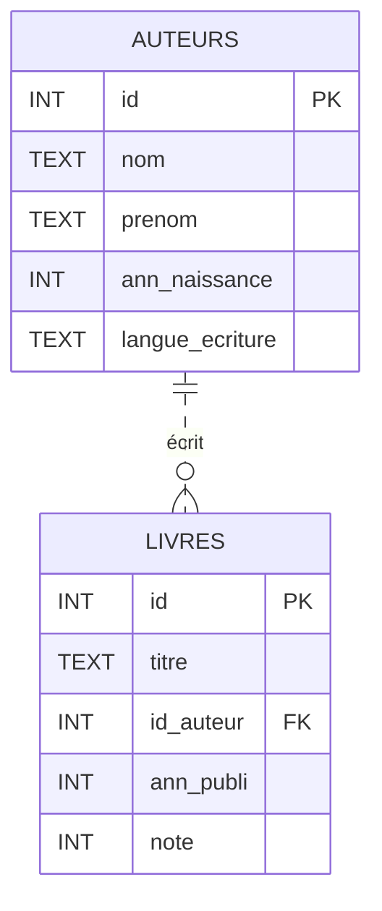

# Base de données *SQLite*

## Tables :
- auteurs
- livres

## Schémas :

```sql
CREATE TABLE AUTEURS
(id INT, nom TEXT, prenom TEXT, ann_naissance INT, langue_ecriture TEXT, PRIMARY KEY (id));

CREATE TABLE LIVRES
(id INT, titre TEXT, id_auteur INT, ann_publi INT, note INT, PRIMARY KEY (id), FOREIGN KEY (id_auteur) REFERENCES AUTEURS(id));
```


