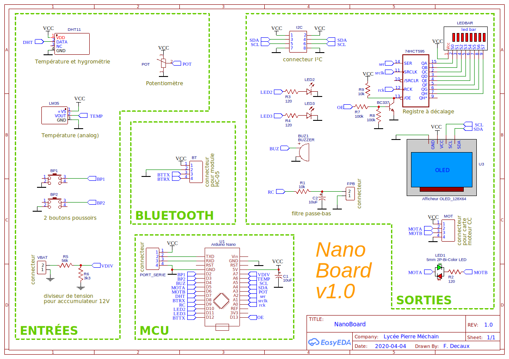
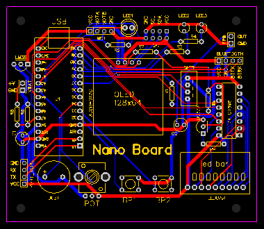

Page *markdown* réalisée dans *VS Code* (sauf édition du chronogramme)

> Outils utilisés :
> 
> - Extension *VS Code* : [Draw.io Integration](https://marketplace.visualstudio.com/items?itemName=hediet.vscode-drawio)
> - Extension *VS Code* : [Draw.io Integration: WaveDrom plugin](https://marketplace.visualstudio.com/items?itemName=nopeslide.vscode-drawio-plugin-wavedrom)
> - Convertisseur **JS Object ⇒ JSON** : [transform.tools](https://transform.tools/js-object-to-json)
> - Éditeur de chronogrammes : [Wavedrom](https://wavedrom.com/)
>
> Alternative pour créer les chronogrammes :
> - Extension *VS Code* : [Fix JSON](https://marketplace.visualstudio.com/items?itemName=oliversturm.fix-json)
> - Extension *VS Code* : [Waveform Render](https://marketplace.visualstudio.com/items?itemName=bmpenuelas.waveform-render)

Synchronisation dans *GitHub* par le **Contrôle de code source** (`Ctrl+Maj+G`) de *VS Code*.

---

# L'inverseur 🙃

> ou fonction logique `NON`

## Table de vérité

| entrée | sortie |
| :----: | :----: |
|   0    |   1    |
|   1    |   0    |

## Symbole et chronogramme

<!--
Objet JS du chronogramme :
{ signal: [
  { name: "entrée", wave: '010.1.' },
  { name: "sortie", wave: '101.0.' },
]}
-->

## Schéma à transistor bipolaire

---

Pas chouette finalement... Il y a quelques années je dessinais des trucs comme ça (pas avec *draw.io*) :

La viellerie me guette 😕