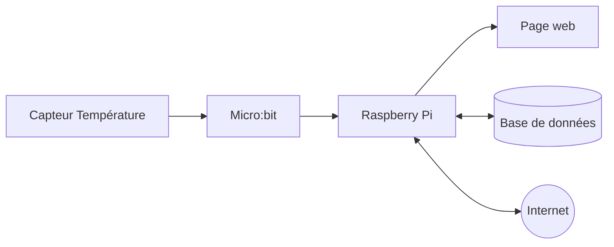
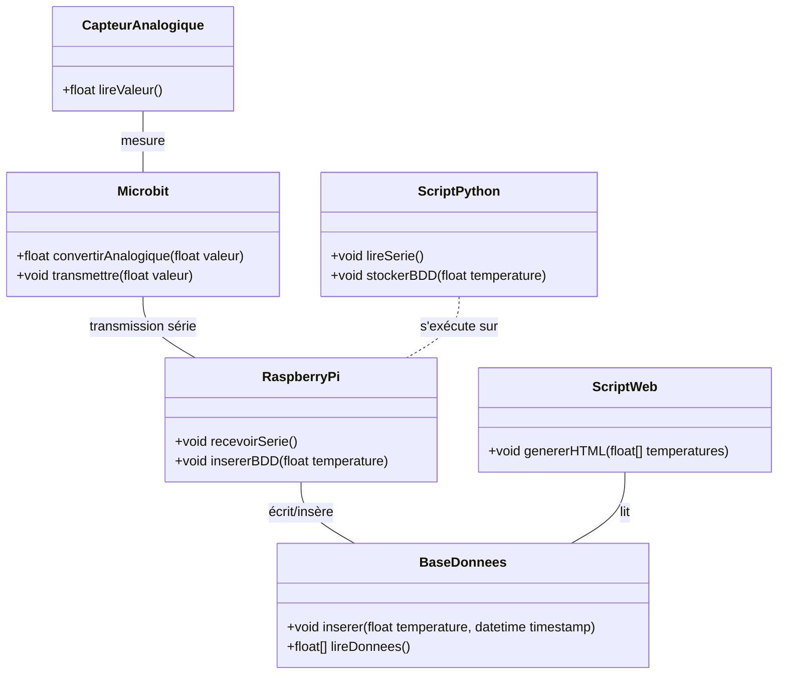
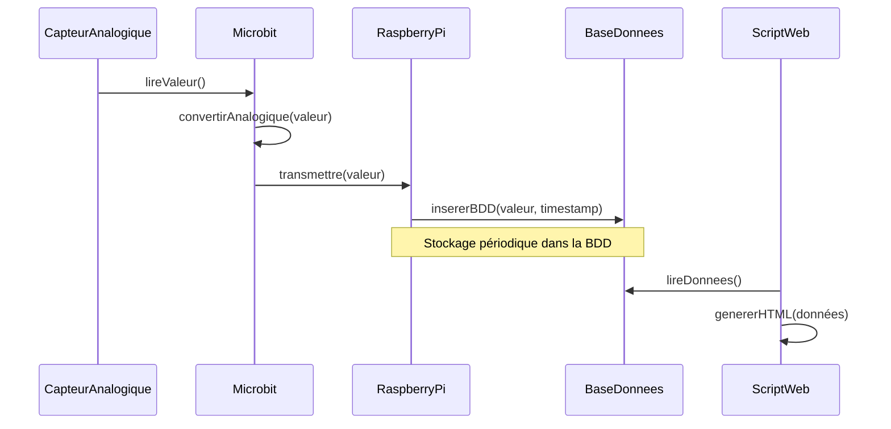
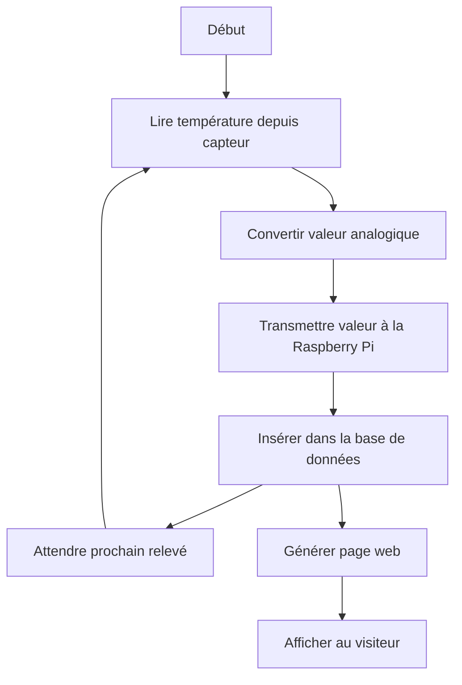

# Mesure de température

## Synoptique

### Ce document présente, à l'aide de diagrammes UML Mermaid, l'architecture d'un projet :

- Mesure de température par capteur analogique
- Transmission des données à une micro:bit
- Transmission série vers une Raspberry Pi
- Stockage dans une base SQLite avec Python
- Génération d'une page web à partir des données

---

## Diagramme de classes 

---

## Diagramme de séquence 

---

## Diagramme d'activités 

