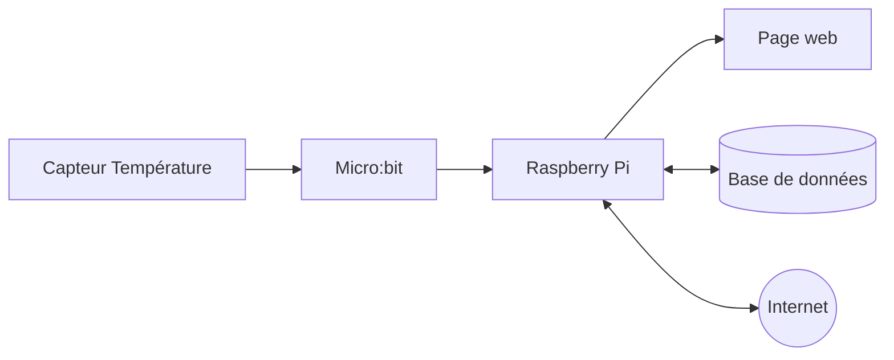
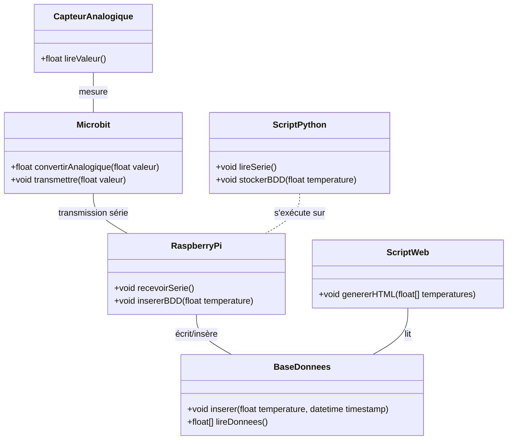
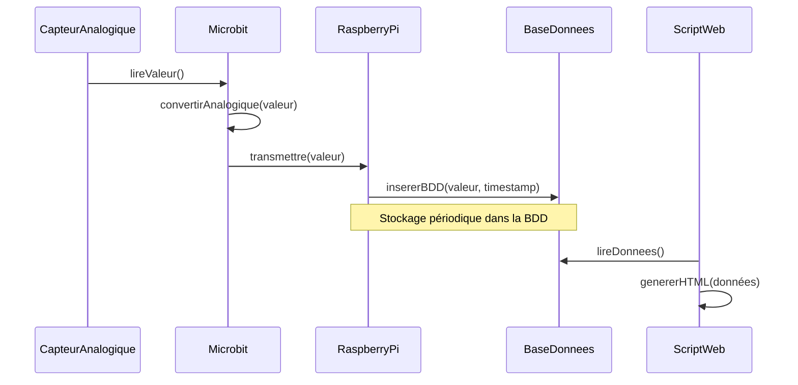
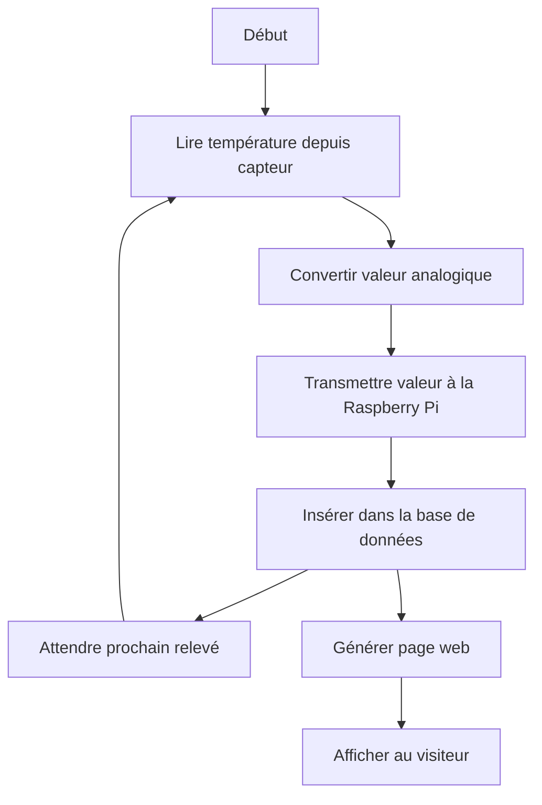

# Mesure de température

## Synoptique



Ce document présente, à l'aide de diagrammes UML Mermaid, l'architecture complète d'un projet :

- Mesure de température par capteur analogique
- Transmission des données à une micro:bit
- Transmission série vers une Raspberry Pi
- Stockage dans une base SQLite avec Python
- Génération d'une page web à partir des données


## Sommaire
1. [Diagramme des cas d'utilisation](#cas-utilisation)
2. [Diagramme de classes](#classes)
3. [Diagramme de séquence](#sequence)
4. [Diagramme d'activités](#activites)
5. [Diagramme de composants](#composants)
6. [Diagramme de déploiement](#deploiement)


---

## 1. Diagramme des cas d'utilisation <a id="cas-utilisation"></a>

```mermaid
usecaseDiagram
    actor "Utilisateur" as User
    actor "Serveur Web" as WebServer

    User --> (Consulter température)
    (Consulter température) --> WebServer
    (Consulter température) .> (Mesurer température) : <<include>>
    (Consulter température) .> (Stocker température) : <<include>>

    actor "Technicien" as Technician
    Technician --> (Configurer système)
```

---

## 2. Diagramme de classes <a id="classes"></a>



---

## 3. Diagramme de séquence <a id="sequence"></a>



---

## 4. Diagramme d'activités <a id="activites"></a>



---

## 5. Diagramme de composants <a id="composants"></a>

```mermaid
componentDiagram
    component CapteurAnalogique
    component Microbit
    component "Script Python Collecte" as Collecte
    component "Base de Données SQLite" as SQLite
    component "Script Python Web" as WebScript
    component Navigateur
    component RaspberryPi

    CapteurAnalogique -- Microbit
    Microbit -- RaspberryPi : Liaison série
    RaspberryPi -- Collecte
    Collecte -- SQLite
    WebScript -- SQLite
    Navigateur -- WebScript : HTTP
```

---

## 6. Diagramme de déploiement <a id="deploiement"></a>

```mermaid
deploymentDiagram
    node "CapteurAnalogique" {
        component CapteurAnalogique
    }
    node "Microbit" {
        component Microbit
    }
    node "Raspberry Pi" {
        component "Script Python Collecte"
        component "Script Python Web"
        component "Base de Données SQLite"
    }
    node "Client Web" {
        component Navigateur
    }

    CapteurAnalogique -- Microbit
    Microbit -- "Raspberry Pi" : Série
    "Raspberry Pi" -- "Client Web" : HTTP
```

---

**Ce document sert de modèle complet pour présenter un projet IoT simple mêlant matériel, scripts Python, base de données et page web.**

Vous pouvez adapter chaque diagramme selon le niveau d'approfondissement souhaité.

