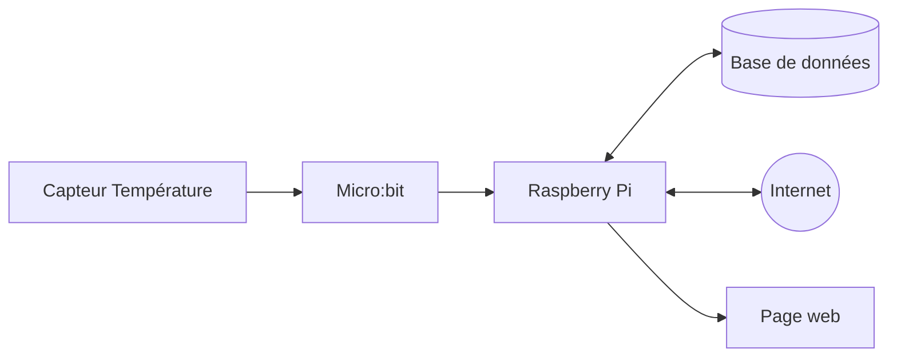

```mermaid
flowchart LR
    TempCapteur["Capteur Température"] --> Microbit["Micro:bit"]
    Microbit --> Raspberry["Raspberry Pi"]
    Raspberry <--> BaseDeDonnees[("Base de données")] & Internet(("Internet"))
    Raspberry --> PageWeb["Page web"]
```
