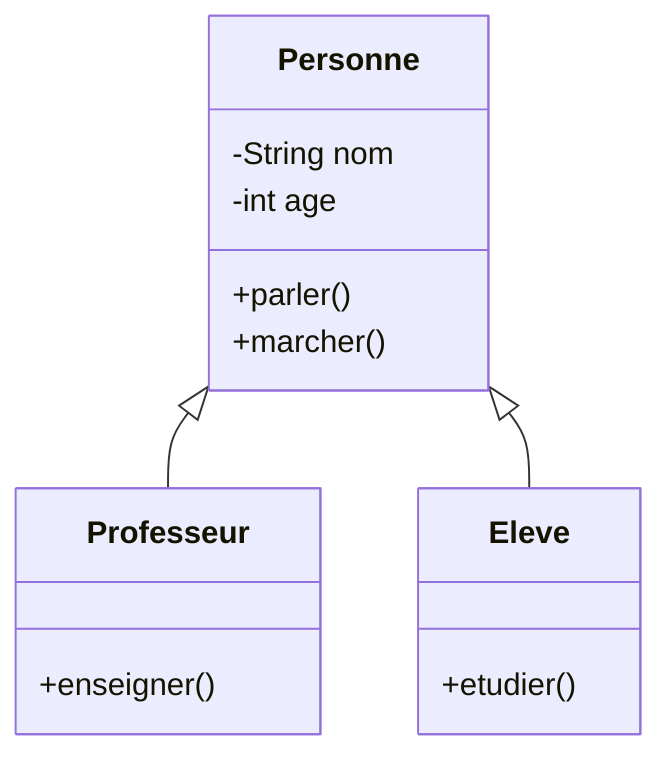
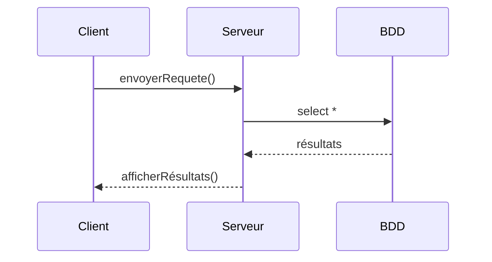
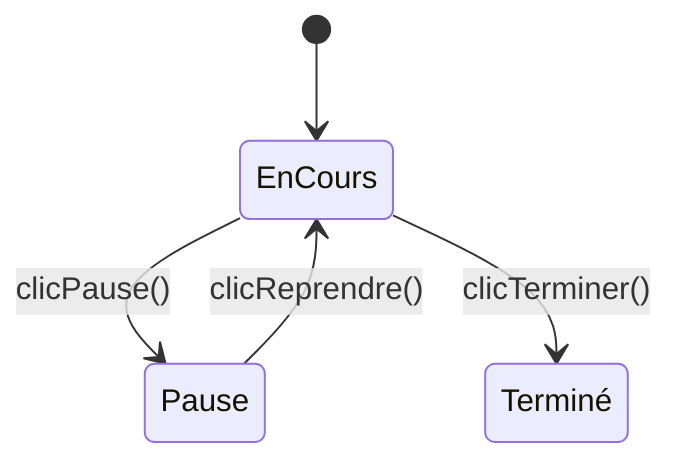
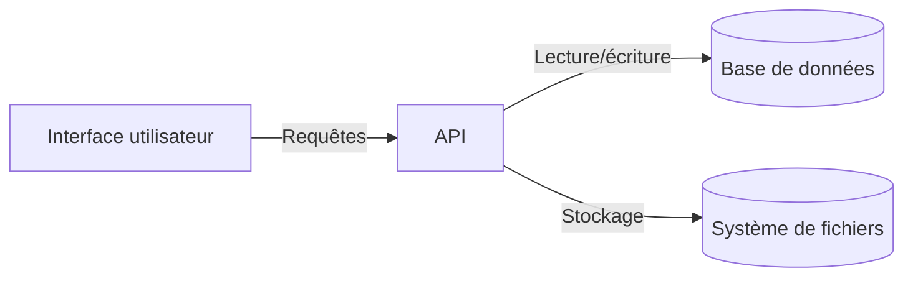
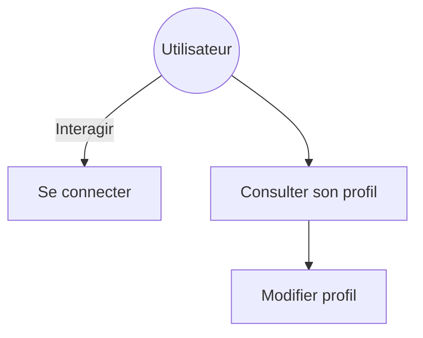

# Exemples de diagrammes UML avec Mermaid

Ce fichier montre plusieurs types de diagrammes UML créés avec le langage **Mermaid**, entièrement compatible avec GitHub.

---

## 🧱 Diagramme de classes UML

---

## 📜 Diagramme de séquence UML

---

## 🔁 Diagramme d’états UML

---

## 📦 Diagramme de composants UML (simple)

---

## 🗂️ Diagramme de cas d’utilisation (use case)

---

💡 **Astuce GitHub** : copiez simplement ces blocs dans un `README.md` de dépôt GitHub — les diagrammes seront automatiquement affichés.

👉 Pour plus d'infos : [https://mermaid.js.org/](https://mermaid.js.org/)
